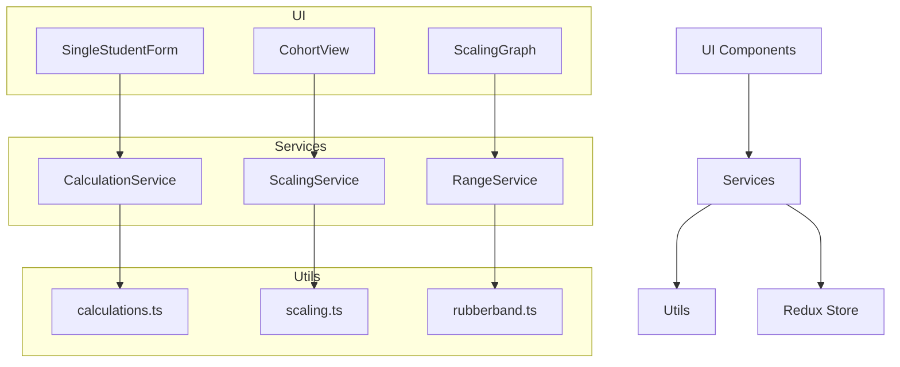

# ATAR Calculator – Architecture Overview

## Purpose

This is a Greenfield rebuild of the ATAR Calculator application. We are rebuilding from scratch based on lessons learned from the previous version, with a strong focus on:

- Clean separation of concerns
- High testability
- Strong modular design
- Maintainability and scalability

## Key Architectural Principles

- Pure functions live in src/utils/. These contain no state, side effects, or dependencies.
- Services go in src/services/. These coordinate stateful operations, cache results, and wrap utility functions.
- UI Components go in src/components/. These handle user input, display, and interface-level validation.
- State Management lives in src/store/, managed via Redux Toolkit.
- Business Rules and validation logic follow domain logic outlined in dev_guide.md.

## Component Flow



### View Transitions
The application supports seamless transitions between cohort and individual student views:

1. **Cohort to Individual Drilldown**
   - Users can click on any student in the cohort results table
   - The app transitions to the individual student view
   - Student data is pre-filled in the single-student components
   - All individual analysis tools become available

2. **State Management**
   - Uploaded cohort data is stored in app-level state
   - Individual student data is accessible across views
   - Components can be re-used with hydrated props
   - State is preserved during view transitions

3. **Component Reuse**
   - SingleStudent components are used in both contexts
   - Props are hydrated from either user input or cohort data
   - Consistent analysis tools across both views
   - Shared validation and calculation logic

## Migration Rules

### Do NOT:
- Reuse legacy code directly
- Call utils directly from components
- Mix validation logic across files

### DO:
- Follow the vertical slice pattern (UI → service → utils)
- Add tests at each layer
- Use only modern, TypeScript-first patterns

## Design Goals

- Deterministic, testable logic
- Minimal coupling between layers
- Reusable modules
- Type-safe and consistent across the app

## Folder Structure and Responsibilities

### src/components/
UI components that handle user interaction and display.

<details>
<summary>Component Details</summary>

#### SingleStudent/
Core functionality for individual student ATAR calculations.

- **SubjectInput.tsx**
  - Handles subject selection and validation
  - Manages subject suggestions/autocomplete
  - Validates subject combinations
  - Props: `onSubjectSelect`, `availableSubjects`, `selectedSubjects`

- **ResultInput.tsx**
  - Manages result entry for each subject
  - Handles different input types (numeric, letter grades, pass/fail)
  - Implements input validation
  - Props: `subject`, `value`, `onChange`, `validationType`

- **ScaledScoreDisplay.tsx**
  - Displays calculated scaled scores
  - Shows individual subject scaling
  - Visualizes score changes
  - Props: `rawScore`, `scaledScore`, `subjectType`

- **RangeModeControls.tsx**
  - Controls for range-based predictions
  - Manages variation input
  - Displays range calculations
  - Props: `variation`, `onVariationChange`, `rangeEnabled`

#### Cohort/
Handles bulk student data and analysis.

- **DataUpload.tsx**
  - CSV/Excel file upload handling
  - Data validation and parsing
  - Error reporting
  - Props: `onDataUpload`, `supportedFormats`

- **ResultsView.tsx**
  - Displays individual student results
  - Sorting and filtering capabilities
  - Data grid implementation
  - Props: `cohortData`, `sortConfig`, `filterConfig`

- **StatisticalSummary.tsx**
  - Statistical analysis of cohort data
  - Distribution visualizations
  - Summary metrics
  - Props: `cohortData`, `metricsConfig`

- **StudentSearch.tsx**
  - Student search functionality
  - Filtering options
  - Result highlighting
  - Props: `students`, `onSelect`, `searchConfig`

#### Scaling/
Visualization and analysis of scaling data.

- **ScalingGraph.tsx**
  - Interactive scaling curve visualization
  - Historical data comparison
  - Zoom and pan controls
  - Props: `scalingData`, `selectedSubjects`, `yearRange`

- **SubjectComparison.tsx**
  - Side-by-side subject comparison
  - Scaling difference analysis
  - Trend visualization
  - Props: `subjects`, `yearRange`, `comparisonMetrics`

#### Equivalent/
Score equivalence calculation tools.

- **ScoreInput.tsx**
  - Input for score conversion
  - Subject selection
  - Result entry
  - Props: `subjects`, `onScoreSubmit`

- **ConversionDisplay.tsx**
  - Shows equivalent scores
  - Comparison visualization
  - Conversion explanation
  - Props: `sourceScore`, `conversions`
</details>

### src/services/
Business logic and external interactions.

<details>
<summary>Service Details</summary>

- **scalingService.ts**
  ```typescript
  export interface ScalingService {
    calculateScaledScore(subject: string, score: number): number;
    getScalingParameters(subject: string): ScalingParameters;
    cacheScalingData(data: ScalingData): void;
    clearScalingCache(): void;
  }
  ```
  - Coordinates scaling operations
  - Manages scaling data caching
  - Handles scaling data loading
  - Performance optimization

- **calculationService.ts**
  ```typescript
  export interface CalculationService {
    calculateATAR(results: StudentResult[]): number | null;
    calculateTEScore(results: StudentResult[]): number | null;
    calculateRange(results: StudentResult[], variation: number): RangeResult;
    cacheResults(results: StudentResult[]): void;
  }
  ```
  - Coordinates ATAR/TE calculations
  - Manages calculation caching
  - Handles complex calculation scenarios
  - Performance optimization

- **rangeService.ts**
  ```typescript
  export interface RangeService {
    applyRange(results: StudentResult[], variation: number): StudentResult[];
    calculateBounds(result: number, variation: number): { lower: number; upper: number };
    validateRange(variation: number): boolean;
  }
  ```
  - Manages range mode operations
  - Handles range calculations
  - Validates range inputs
  - Coordinates with other services

- **dataLoader.ts**
  ```typescript
  export interface DataLoader {
    loadSubjectTypes(): Promise<Subject[]>;
    loadGeneralSubjects(): Promise<GeneralSubject[]>;
    loadAppliedSubjects(): Promise<AppliedSubject[]>;
    loadScalingData(): Promise<ScalingData>;
  }
  ```
  - CSV file loading and parsing
  - Data validation
  - Error handling
  - Caching logic

- **statisticsService.ts**
  ```typescript
  export interface StatisticsService {
    calculateCohortMetrics(data: CohortData): CohortMetrics;
    generateDistribution(scores: number[]): Distribution;
    calculateTrends(historicalData: HistoricalData): Trends;
  }
  ```
  - Statistical calculations
  - Distribution analysis
  - Trend calculations
  - Data aggregation

- **validationService.ts**
  ```typescript
  export interface ValidationService {
    validateSubjectCombination(subjects: string[]): ValidationResult;
    validateResult(subject: string, result: string): ValidationResult;
    validateCohortData(data: unknown[]): ValidationResult;
  }
  ```
  - Input validation rules
  - Data integrity checks
  - Error messaging
  - Validation utilities
</details>

### src/store/
State management using Redux Toolkit.

<details>
<summary>Store Details</summary>

#### slices/
- **subjectsSlice.ts**
  - Subject list management
  - Subject type categorization
  - Loading states

- **calculationsSlice.ts**
  - Calculation results
  - Range mode state
  - Scaling parameters
  - Individual student analysis state

- **cohortSlice.ts**
  - Cohort data management
  - Analysis results
  - Filter states
  - Selected student state for drilldown
  - View transition state

#### selectors/
- **subjectSelectors.ts**
  - Subject filtering
  - Type-based selection
  - Memoized queries

- **calculationSelectors.ts**
  - Score aggregation
  - Range calculations
  - Performance optimized selectors
  - Individual student data extraction

- **cohortSelectors.ts**
  - Cohort data filtering
  - Student selection
  - View transition state
  - Individual student data hydration
</details>

### src/utils/
Pure utility functions with no side effects.

<details>
<summary>Utility Details</summary>

- **calculations.ts**
  ```typescript
  export function calculateTEScore(results: StudentResult[]): number | null;
  export function calculateATAR(teScore: number): number | null;
  export function calculateAggregateScore(scores: number[]): number;
  ```
  - Pure calculation functions
  - Mathematical utilities
  - Score conversion
</details>

## Code Annotation Guidance
To make our Greenfield structure explicit in every new file, we recommend including this comment at the top of each code file:

```typescript
// ATAR Calculator – Greenfield architecture: follow utils/services/components separation and avoid legacy patterns.
```

This serves as an ongoing reminder for contributors and LLMs to follow our architecture principles. 